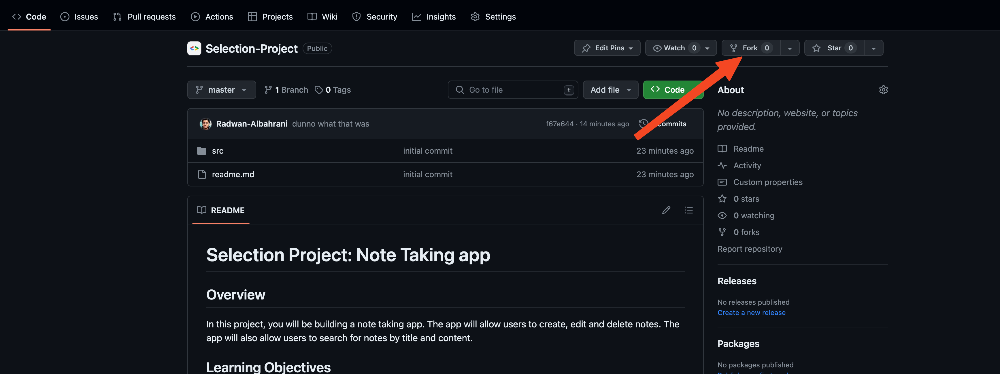
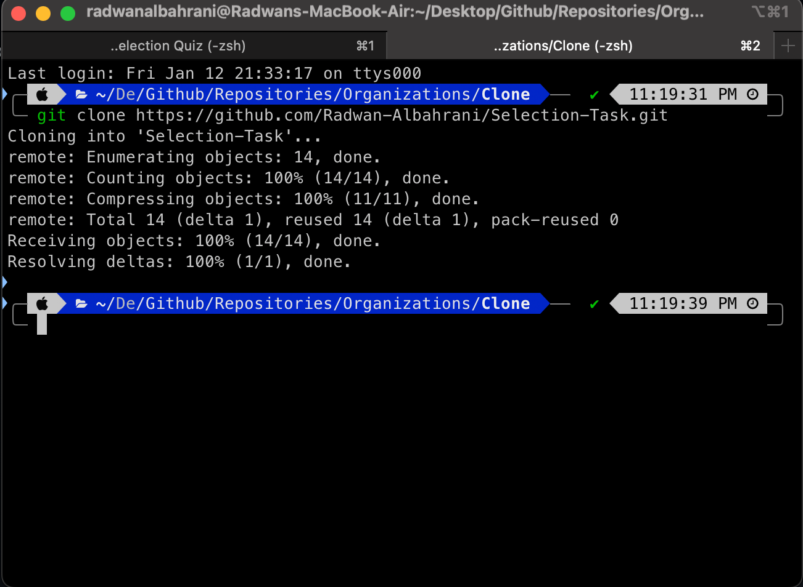

# 

## Table of Contents

- [Overview](#overview)
- [Learning Objectives](#learning-objectives)
- [Resources](#resources)
- [Setup and Tutorial](#setup-and-tutorial)
- [Project Overview](#project-overview)
- [Submission Guidelines](#submission-guidelines)

## Overview

In this project, you will be building a note taking app. The app will allow users to create, edit and delete notes. The app will also allow users to search for notes by title and content.

## Learning Objectives

By the end of this project, you should be able to:

- Learn and understand git and Github
- Install Dart on your local machine
- Learn and understand the basics of Dart
  - Declare and initialize variables
  - Handle errors using try-catch blocks
  - Define classes and use constructors
  - Understand Dart's null safety feature
- Learn to use proper code structuring and formatting
- Build a simple note taking app

## Resources

### Online Resources

#### Github

- [Git and Github](https://www.youtube.com/watch?v=tRZGeaHPoaw)
- [Git Tutorial (w3schools.com)](https://www.w3schools.com/git/default.asp)
- [How to Use Git and GitHub – Introduction for Beginners (freecodecamp.org)](https://www.freecodecamp.org/news/introduction-to-git-and-github/)
- [Learn Git Branching](https://learngitbranching.js.org/) (Interactive tutorial)
- [Git - Basic Branching and Merging (git-scm.com)](https://git-scm.com/book/en/v2/Git-Branching-Basic-Branching-and-Merging)
- [Pull Requests in VS Code - YouTube](https://www.youtube.com/watch?v=LdSwWxVzUpo)

#### Dart

- [Dart Documentation](https://dart.dev/guides)
- [DartPad](https://dartpad.dev/)
- [What is Dart?](https://www.youtube.com/watch?v=NrO0CJCbYLA)
- [Dart Basics | Long Video](https://www.youtube.com/watch?v=Fqcsow_7go4)
- [Dart Basics | Articles](https://www.geeksforgeeks.org/dart-tutorial/)

### Custom Resources

- [Github Introduction (Arabic)](https://www.youtube.com/watch?v=qCp9QpVeJPE)
- [Task Explanation Video (Arabic)](https://www.youtube.com/watch?v=g2eYPeY-ah0&)
- [Task Explanation Video (English)](https://www.youtube.com/watch?v=ARkfF1wIAlw)

## Setup and Tutorial

### 1. Setup

#### 1.1. Install Git (Windows Users Only)

- [Download Git](https://git-scm.com/downloads)

#### 1.2. Install Dart

##### 1.2.1. Windows (Using Chocolaty)

- Open powershell as an administrator.

  

- Run the following command to install Chocolaty:

```bash
Set-ExecutionPolicy Bypass -Scope Process -Force; [System.Net.ServicePointManager]::SecurityProtocol = [System.Net.ServicePointManager]::SecurityProtocol -bor 3072; iex ((New-Object System.Net.WebClient).DownloadString('https://community.chocolatey.org/install.ps1'))
```

- Run the following command to install Flutter:

```bash
choco install flutter
```

- Run Flutter Doctor to check if Flutter is installed properly:

```bash
flutter doctor
```


- If you have any red checks, follow the flutter doctor instructions to fix them. Or follow the below checklist.

#### Windows: The following is a checklist of everything you need to have done before continuing with the project 👍🏽🫡

- [ ] Flutter installed
- [ ] Android Studio installed
  - Go to the [android studio](https://developer.android.com/studio) website and download the latest version.
- [ ] Android SDK installed (Steps shown below)


- [ ] Visual Studio Desktop development with C++ installed
  - You can Install it by following these steps:
    - Install Visual Studio from the following link: [Visual Studio](https://visualstudio.microsoft.com/downloads/)
    - Select Visual Studio Community Edition
    - When running the installer, make select the Desktop development with C++ Component
- [ ] Android emulator installed
  - Go to android studio and click on the AVD manager button.
  
  - Click on create virtual device.
  
  - Select the device you want to emulate and click next.
  - Select the version of android you want to emulate and click next.
  - Click on finish.

##### 1.2.2. MacOS (Using Homebrew)

- Open the terminal.

- Run the following command to install Homebrew:

```bash
/bin/bash -c "$(curl -fsSL https://raw.githubusercontent.com/Homebrew/install/HEAD/install.sh)"
```

- Run the following command to install Flutter:

```bash
brew install flutter --cask
```


- Run Flutter Doctor to check if Flutter is installed properly:

```bash
flutter doctor
```


- If you have any red checks, follow the flutter doctor instructions to fix them. Or follow the below checklist.

#### MacOS: The following is a checklist of everything you need to have done before continuing with the project 👍🏽🫡

- [ ] Flutter installed
- [ ] Android Studio installed
  - [ ] Go to the [android studio](https://developer.android.com/studio) website and download the latest version.
- [ ] Xcode installed
  - Go to the [app store](https://apps.apple.com/us/app/xcode/id497799835?mt=12) and download Xcode.
- [ ] Android SDK installed


- [ ] Xcode command line tools installed
  - Run the following command in the terminal

  ```bash
  sudo sh -c 'xcode-select -s /Applications/Xcode.app/Contents/Developer && xcodebuild -runFirstLaunch'
  ```

- [ ] iOS simulator installed
  - Run the following command in the terminal

  ```bash
  xcodebuild -downloadPlatform iOS
  ```

- [ ] xcode license accepted
  - Run the following command in the terminal

  ```bash
  sudo xcodebuild -license

#### 1.3. Install VS Code

- [Download VS Code](https://code.visualstudio.com/download)

#### 1.4 Fork the repository

- Fork the repository by clicking the fork button on the top right corner of the repository page.
  - Click the fork Button

  

  - Name the repo and click "Create fork"
  

  - You should now have a copy of the repository on your own account.
  

### Tutorial

#### 2.1. Git

##### 2.1.1. Clone the repository

- Open the terminal and navigate to the directory (also known as folder) where you want to clone the repository.
  - Make sure the path you choose has NO ARABIC LETTERS. This will cause errors.
    - On Mac:
  
    - On Windows:
  
- Go to the repository page on **your own account** and click on the green code button.
- Copy the link under the clone section.

- Run the following command to clone the repository:

```bash
git clone <The Link from your Repository>
```

Example:

```bash
git clone https://github.com/YOUR_NAME/Selection-Project.git
```



##### 2.1.2. Add changes

- Open the repository directory in VS Code.
  - The path must be INSIDE the cloned repository.
  - Click on File -> Open folder
  
  - Select the repository folder.
  
  - The repository should be opened in VS Code.
  
  - To make sure, run the following command in the terminal:

  ```bash
  git status
  ```

  - The output should be similar to the following:
  

---------------------------------------------------------------------------------------------------------------------------------------------------------------------------------

#### You are now ready to code! Make the required changes which are given in section [Project Overview](#project-overview) and then follow the steps below to push your changes to Github. Make sure to regularly commit your changes. If you want to continue the tutorial, skip to section [2.2. Dart](#22-dart)

---------------------------------------------------------------------------------------------------------------------------------------------------------------------------------

- Run the following command to add the changes:

```bash
git add .
```

##### 2.1.3. Commit changes

- Run the following command to commit the changes:

```bash
git commit -m "<commit-message>"
```

##### 2.1.4. Push changes

- Run the following command to push the changes:

```bash
git push
```


##### 2.1.5. Create a pull request

- Go to the repository page and click on the pull request button.

- Click on the new pull request button.

- Select the branch you want to merge into the main branch.

- Click on the create pull request button.

- Add a title and description for the pull request. Title should be in the following format: `<your-name> - <project-name>`.

- Click on the create pull request button.


#### 2.2. Dart

##### 2.2.1. Variables

- Variables are used to store data.
- Variables can be initialized using the `=` operator.
- Variables can be declared and initialized in the same line.

```dart
String name = "Ahmed";
```

- Variables can be declared without initializing them.

```dart
String name;
```

- Variables can be initialized later.

```dart
name = "Ahmed";
```

##### 2.2.2. Data Types

- Dart is a strongly typed language.
- Dart has the following data types:
  - Numbers
    - int
    - double
  - Strings
  - Booleans
  - Lists
  - Maps
  - Runes
  - Symbols
- Dart also has the `dynamic` data type which can be used to store any type of data.
- Dart also has the `var` keyword which can be used to declare variables without specifying the data type.

##### 2.2.3. Error Handling

- Errors can be handled using try-catch blocks.
- The try block contains the code that might throw an error.
- The catch block contains the code that will be executed if an error is thrown.

```dart
try {
  // Code that might throw an error
} catch (e) {
  // Code that will be executed if an error is thrown
}
```

Here is an example:

```dart
try {
  int result = 12 ~/ 0;
  print(result);
} catch (e) {
  print("Error: Cannot divide by zero");
}
```

##### 2.2.4. Classes

- Classes are used to define objects.
- Classes can have properties and methods.
- Properties are variables that belong to the class.
- Methods are functions that belong to the class.
- Classes can have constructors.

```dart
class Person {
  String name;
  int age;

  Person({this.name, this.age});
}
```

- The `this` keyword is used to refer to the current instance of the class.
- The `this` keyword can be used to initialize properties in the constructor.

```dart
Person person = Person(name: "Ahmed", age: 20);
```

##### 2.2.5. Null Safety

- Null safety is a feature that was introduced in Dart 2.12.
- Null safety is used to prevent null reference errors.
- Null safety is enabled by default in Dart 2.12.

```dart
String name = "Ahmed";
```

- The above code will throw an error if the variable `name` is null.
- To allow a variable to be null, add a `?` after the data type.

```dart
String? name = "Ahmed";
```

- The above code will not throw an error if the variable `name` is null.
- To check if a variable is null, use the `==` operator.

```dart
if (name == null) {
  print("Name is null");
}
```

##### 2.2.6. Code Structuring and Formatting

- Code should be structured and formatted properly.
- Code should be divided into functions and classes.
- Functions and classes should be named properly.
- Functions and classes should be defined before they are used.

An example code structure is provided within the repository itself.

## Project Overview

Your project is to build a note taking app. The app should allow users to create, edit and delete notes. The app should also allow users to search for notes by title and content.

### Requirements

- The CLI (Command line interface) should display a menu with the following options:
  - Create a note
  - Edit a note
  - Delete a note
  - Search for a note
  - Exit
- All CRUD (Create, Read, Update, Delete) operations should be performed within the CLI.
- The app should handle errors using try-catch blocks.
- The app should use classes and constructors.
- The app should use Dart's null safety feature.
- The app should follow proper code structuring and formatting.
- The app should be well documented.

## Submission Guidelines

- The app should be pushed to Github and a pull request should be created. You can check how to push your code to Github in section [2.1.2 Add Changes](#212-add-changes)
- The pull request title should be in the following format: `<your-name> - <project-name>`. You can check how to make a pull request in section [2.1.5. Create a pull request](#215-create-a-pull-request).
- The pull request description should contain the following:
  - A description of the changes made.
  - A screenshot of the app running in the terminal.
